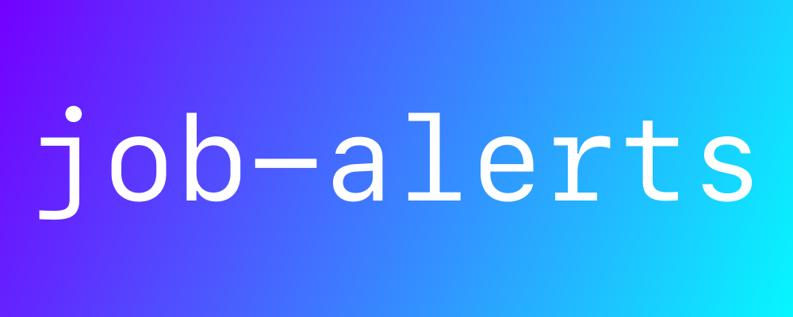
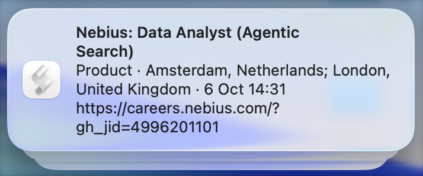
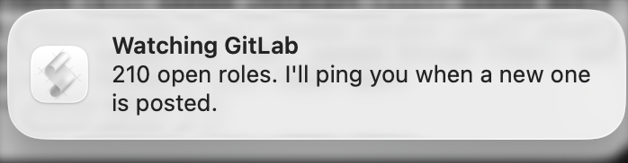

# job-alerts

<p align="center">
  
</p>

job-alerts watches public Greenhouse, Lever, and Ashby boards and sends a macOS notification or opens a GitHub issue when a new role appears.

You list the companies you care about. The first run remembers every role already open and stays quiet. After that, a new posting can ping your Mac, open a GitHub issue, or both.

This repo is the blank version. It does not watch any real company until you add one.

A new role:



The first time a company is added, the only notice is that it is now being watched. Roles already open stay quiet:



A wide search is built to show you many roles. That is useful when you want the net. It gets noisy when you already know the employers, the city, and whether you want remote or hybrid. This watches that short list. `keywords` and `locations` keep the ping to roles you would actually open.

When a role appears, paste the link into [career-ops](https://github.com/career-ops-hq/career-ops). That is the step that scores the fit and drafts the resume. You still press submit. This project does not do that job, and it does not try to.

## Add a company

```bash
cp companies.example.json companies.json
```

`companies.json` is gitignored, so a public copy of this project does not publish your list. Edit the copy:

```json
[
  {
    "name": "Acme",
    "source": "greenhouse",
    "board": "acme",
    "keywords": [],
    "locations": ["amsterdam"]
  }
]
```

`keywords` and `locations` are optional filters. Leave them empty to hear about every new role. A role that does not match is still remembered, so changing the filter later does not replay the whole board. A role the board marks as remote matches a `remote` location even when the city is somewhere else.

Then check once:

```bash
python3 watch.py
```

### Greenhouse

The board token is the slug in this URL:

```text
https://boards-api.greenhouse.io/v1/boards/TOKEN/jobs
```

Open that URL. If you get JSON, the token is right. It is often the company name in lowercase. `"source"` is `"greenhouse"`.

### Lever

The site name is the last part of `https://jobs.lever.co/SITE`. The feed is:

```text
https://api.lever.co/v0/postings/SITE?mode=json
```

`"source"` is `"lever"` and `"board"` is that site name.

### Ashby

The board name is the last part of `https://jobs.ashbyhq.com/NAME`. The feed is:

```text
https://api.ashbyhq.com/posting-api/job-board/NAME
```

`"source"` is `"ashby"` and `"board"` is that board name.

## Mac notifications

On macOS, while you are logged in:

```bash
python3 watch.py --install
python3 watch.py --status
python3 watch.py --uninstall
```

`--install` runs a check every 5 minutes.

Click a role banner to open the job. The notifier is the small app in `macos/job-alerts.app`, and macOS files those banners under job-alerts. The first time it runs, allow notifications for job-alerts in System Settings. The pictures at the top of this page are a new role and the quiet first run. If that app is missing, the banner still appears, filed under Script Editor, and the link is in the text.

The check runs only while the Mac is awake. Closing the lid usually puts it to sleep, so nothing runs and no banner can appear. When you open the lid, the missed check runs and notifications for roles posted while you were away show up then. A full shutdown is the same: the check runs the next time you log in.

If the Mac is plugged in, awake, and driving an external display with the lid shut, the checks keep running.

## GitHub issues

`.github/workflows/check.yml` runs about every 15 minutes on GitHub's computers, including while your laptop is asleep. GitHub sometimes starts a scheduled run later than the timetable.

Each new role becomes an issue titled `Company: Role`, with the apply link and a checkbox. Close the issue when you have applied, or when you are not interested. At most 20 issues are opened per run; the rest wait for the next one.

The workflow does nothing until `companies.json` is committed. Put it in the repo on purpose:

```bash
git add -f companies.json
git commit -m "Watch the companies I care about"
git push
```

The action then remembers seen roles in `state/seen.json` and commits that file. Deleting that file makes the next run treat the board as new and stay quiet, instead of opening an issue for every current role.

You cannot fork your own repository into the same GitHub account. To keep a public blank copy and a public personal copy:

1. On this repo, open Settings → General and check **Template repository**.
2. Click **Use this template** and create a new public repo.
3. Add your `companies.json` there and push it.

The personal repo is the one that names the companies you are watching. This one stays empty of them.

## What it will not do

It only reads public board feeds. A role posted as internal-only never shows up. It does not submit applications.

## Questions

### How do I get notified when a Greenhouse job is posted?

Put the board token in `companies.json`, then run `python3 watch.py --install` on a Mac, or commit that file so GitHub Actions opens an issue. The token is the slug in `https://boards-api.greenhouse.io/v1/boards/TOKEN/jobs`. Lever and Ashby use the same file with a different `"source"`.

### Does it run while my laptop is closed?

The Mac notification runs only while the Mac is awake and you are logged in. Closing the lid usually sleeps the machine, so the banner appears after you open it, for roles posted while you were away. The GitHub Action runs on GitHub's computers and can open an issue while the laptop is shut.

### Does the first run alert me about every open role?

No. The first time a company is seen, every current role is remembered and no alert is sent. Alerts start with roles posted after that.

### I already use career-ops. Why this too?

career-ops starts when you prompt it or when you paste a job. This starts when a company you listed posts something new, so you're notified first and open career-ops to finish the job. Use the notification to get alerts about the vacancy, then paste that link into career-ops for the resume. A broad scan is a different tool: it is built to surface a lot of roles, including ones outside the companies and places you already chose.
